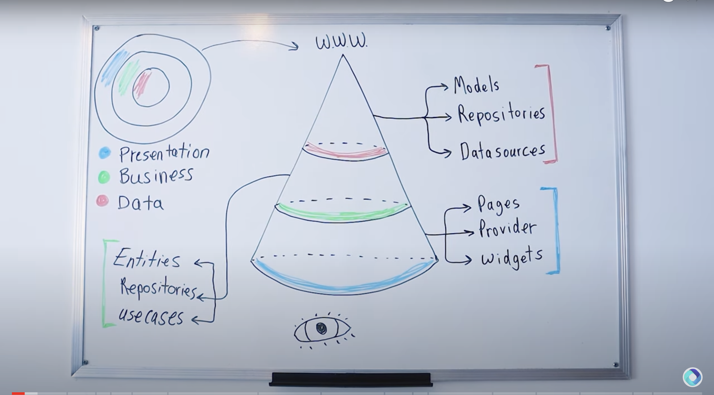

# provider_clean_architecture

Flutter provider clean architecture.

## Getting Started
 - [Youtube Link](https://www.youtube.com/watch?v=SmJB8cy8emU&ab_channel=FlutterMapp)
 - [Github Link](https://github.com/fluttermapp/flutter_mapp_clean_architecture/)

## Definitions of the clean architecture.
1. Presentation layer
   - Pages - actual view i.e. HomePage
   - StateManagement package - i.e. either Provider | GetX | BLoC | Riverpod
   - Widgets - i.e. button, bottom-nav-bar
2. Business layer
   - Entities - What we get from the API i.e. the response.
   - Repository - The bridge between the business layer and the data. It is an abstract class which will be implemented by Data.Repository 
   - Usecase - The action taken i.e. call to get data 
3. Data layer
   - Data source:
        - Local data source - Saved data in device
        - Remote data source - Data from API
   - Models - Same to entities only that toJson and fromJson functions.
   - Repository - The bridge between the data layer and business layer. It has the implementation logic. where it extends from Business.Repository

# ScreenShots

